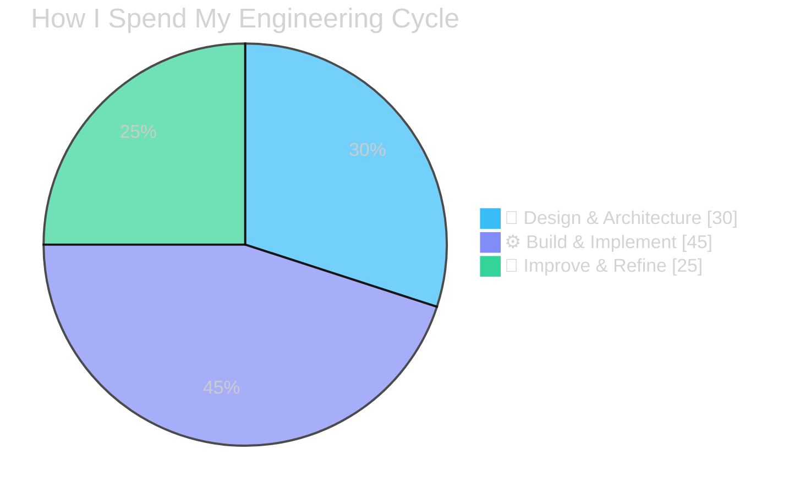
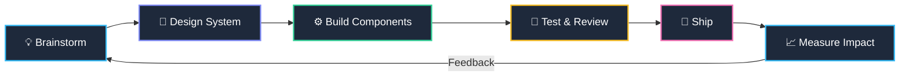
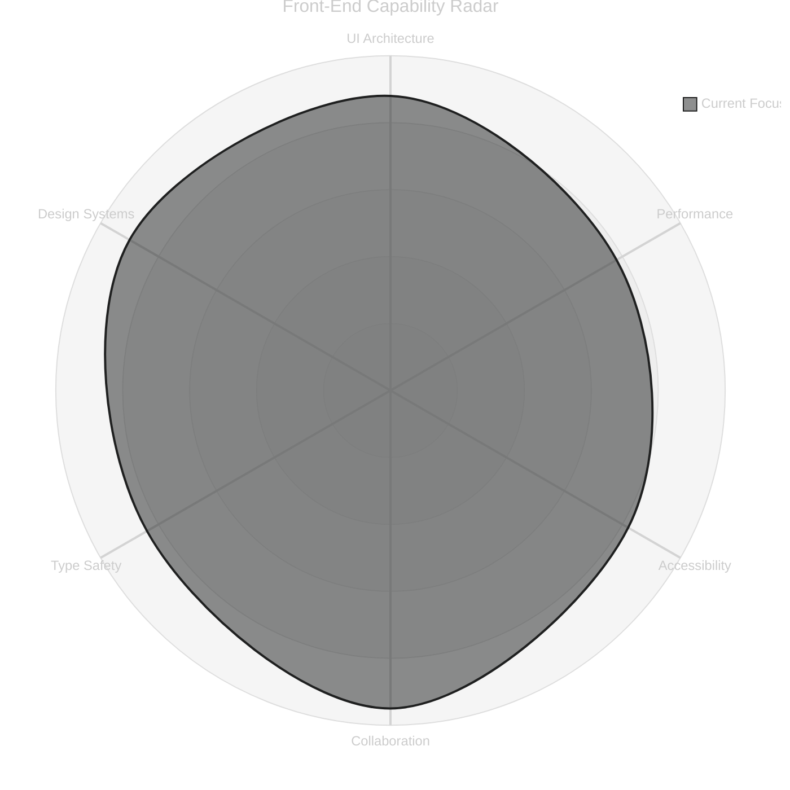

<div align="center">

# Hi, I'm [Your Name] 👋
### Front-End Engineer · Turning "what if" into working software


[](#)
[](#)
[](#)
[](#)

</div>

---

## 🧭 About Me

I'm a front-end developer who got hooked the moment I realized a browser tab could become *anything* — a tool, a game, a canvas, a conversation. That fascination hasn't worn off. I care less about "finishing" software and more about the loop that makes it good: **design it, build it, break it, improve it, repeat.**

I do my best work in rooms (or Slack threads) full of disagreement — sketching a system on a whiteboard, arguing about an API shape, pairing through a gnarly bug. I'm equally happy explaining a concept to someone new as I am learning one from someone who's been doing this longer than me. If you're building something and want a second brain on the front-end, I'm in.

- 🔭 Currently building interfaces with **React** + **TypeScript**
- 🎨 Obsessed with **design systems** that scale without becoming spaghetti
- 🌱 Always mid-way through learning *something* — right now it's deeper animation/perf work
- 🤝 Open to collaborating on open-source UI tooling & design systems
- ⚡ Fun fact: I debug CSS by talking to it out loud (it rarely talks back)

---

## 🛠️ Tech Stack & Mastery

> Not just tools — roles each one plays in how I ship software.

```text
HTML5         ████████████████████░░  92%   → Semantic Foundations & Accessibility
CSS3          ███████████████████░░░  88%   → Responsive & Adaptive Layouts
JavaScript    ██████████████████░░░░  86%   → Interactive Logic & DOM Orchestration
TypeScript    █████████████████░░░░░  82%   → Type-Safe Contracts & Refactor Confidence
React         ███████████████████░░░  90%   → Architecting Scalable, Component-Driven UIs
Tailwind CSS  ████████████████████░░  91%   → Rapid, Consistent Design Systems
```

<div align="center">

| Technology | Role in the Lifecycle | Confidence |
|:--|:--|:--:|
| ⚛️ **React** | Architecting scalable, stateful UI systems | ⭐⭐⭐⭐⭐ |
| 🟦 **TypeScript** | Type-safe logic & long-term maintainability | ⭐⭐⭐⭐☆ |
| 🎨 **Tailwind CSS** | Responsive design at production speed | ⭐⭐⭐⭐⭐ |
| 🟨 **JavaScript (ES6+)** | Core interactivity & data flow | ⭐⭐⭐⭐☆ |
| 🎭 **CSS3** | Layout systems, motion, visual polish | ⭐⭐⭐⭐☆ |
| 🧱 **HTML5** | Accessible, semantic structure | ⭐⭐⭐⭐⭐ |

</div>

<div align="center">


</div>

---

## 📊 System Design & Impact

### Effort Distribution — Design → Build → Improve



### The Loop I Work In



### Skill Radar — Where I Add the Most Value



> **Note:** If `radar-beta` doesn't render in your Mermaid version, here's the ASCII fallback ⬇️

```text
                 UI Architecture
                       ▲ 88
                       │
   Design Systems ◄────┼────► Performance
        90              78
                       │
       Type Safety ◄───┼───► Accessibility
           84           82
                       │
                 Collaboration
                      95
```

---

## 🤝 Collaboration & Philosophy

```text
┌──────────────────────────────────────────────────────────┐
│  "The best interfaces I've built were never solo work."   │
└──────────────────────────────────────────────────────────┘
```

- 🧩 **I brainstorm before I build.** A whiteboard argument saves a week of refactoring.
- 🗣️ **I teach what I learn, and learn from everyone.** Knowledge that stays in one head doesn't scale — neither does software built by one person.
- 🔍 **I design for change.** Systems, not one-off screens — because requirements always shift.
- 🔄 **I treat feedback as fuel.** Code review isn't a gate, it's a conversation.
- 🌍 **I believe in open source** as the purest form of collaborative building.

---

## 📫 Let's Build Something

<div align="center">

[](#)
[](#)
[](#)
[](mailto:your.email@example.com)

<br/>


</div>
